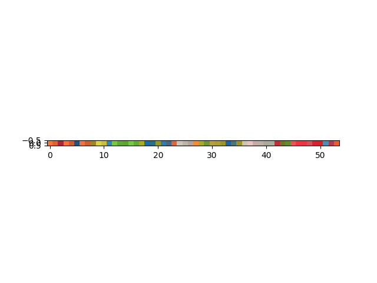

# the cube

intense cube solver

## some notes
it turns out that the algorithms that we wrote down for manipulating the cube are actually not correct
they are probably also broken in the 2by2 case. Just FYI.

## important information

```
virtualenv venv
. venv/bin/activate
pip install -r reqs.txt
```


# indpairs specifies what side goes to what side
# ind flips is the indices on those sides to flip
# ie for R turn the first column of 1 into the first column of 0
"""
   [0]
[5][1][4]
   [2]
   [3]
On all faces this is what it looks like in terms of indices
[00 01 02]
[10 11 12]
[20 21 22]
"""

# https://www.youcandothecube.com/solve-it/2-x-2-solution

